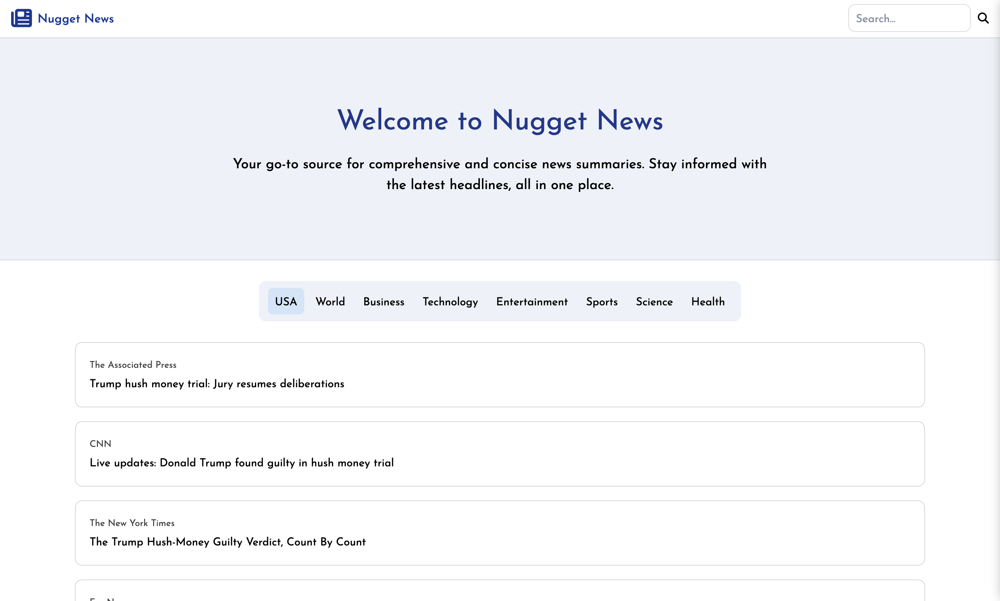

# News Nugget

## Overview

**News Nugget** is a modern web application designed to scrape the web for the latest news articles and provide users with the ability to summarize them. This project leverages powerful technologies such as Next.js, axios, cheerio, puppeteer, and the ChatGPT API to deliver a seamless and efficient news aggregation and summarization tool.

## Key Features

### Next.js

- Utilizes server-side rendering and static site generation for high performance and SEO-friendly pages.
- Provides a robust framework for building a scalable and maintainable web application.

### axios

- Handles HTTP requests to fetch data from various news sources.
- Simplifies the process of making asynchronous requests to gather news articles.

### cheerio

- Parses and manipulates HTML to extract necessary data from web pages.
- Mimics jQuery's functionality to easily select and retrieve elements from the HTML.

### puppeteer

- Automates browsing tasks to handle more complex scraping scenarios.
- Provides headless browsing capabilities to scrape dynamic content from web pages.

### ChatGPT API

- Leverages the ChatGPT API to summarize scraped news articles, providing concise and accurate summaries.
- Enhances the user experience by delivering well-crafted summaries that retain the key points of the original articles.

## Project Focus

This project is an exercise in modern web development, focusing on:

### Client vs. Server Components

- Understanding the effective use of client and server components within Next.js to build a dynamic and responsive application.

### Web Scraping

- Implementing robust web scraping techniques with cheerio and puppeteer to gather the latest news articles from multiple sources.

### Data Fetching and State Management

- Managing state and fetching data efficiently in a React application, ensuring smooth user interactions and data updates.

### UI Design and User Experience

- Utilizing Tailwind CSS (or similar styling framework) to create a visually appealing and user-friendly interface, with a focus on responsiveness and customization.

### Article Summarization

- Leveraging the ChatGPT API to provide concise and accurate summaries of news articles.
- Ensuring the summaries retain all key parts and provide context for a comprehensive understanding.

[Visit News Nugget](https://news-nugget-one.vercel.app/)

